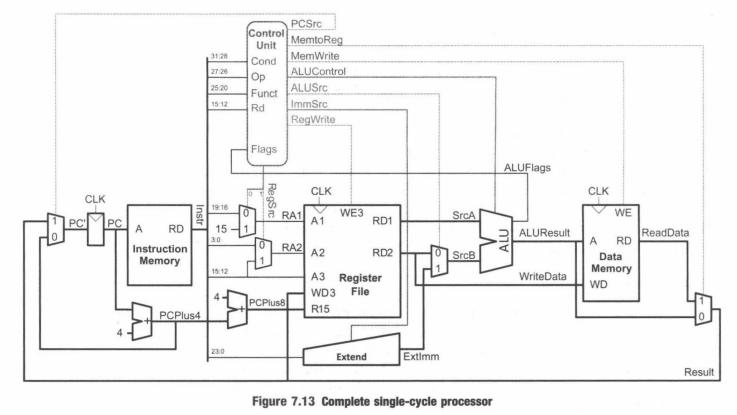

# MCU — 基于 ARM32 指令集的单周期处理器（BASYS3 实测可运行排序）

一个以 ARMv4/v5 风格编码为参考的 32 位单周期 MCU，支持核心数据处理与访存/分支指令：ADD、SUB、AND、OR、MOV、LDR、STR、B，并带条件执行（Cond）与标志位控制。工程已在 Digilent BASYS3（Artix-7）FPGA 开发板上成功完成数组排序任务并通过 ILA 观测验证。

## 特性概览

- 架构：单周期（非流水），指令宽度 32 位，字对齐取指
- 指令子集：ADD、SUB、AND、ORR(OR)、MOV、LDR、STR、B（含条件执行）
- 标志位：N、Z、C、V；通过 decoder + conditional_logic 门控写回/存储/跳转
- 立即数扩展：
  - 数据处理指令支持 8 位立即数 + 旋转右移（Rotate Right）
  - Load/Store 12 位零扩展偏移
  - Branch 24 位符号扩展并左移 2 位（字对齐）
- 寄存器：R0–R15（R15 作为 PC 只读读取 PC+8 语义，写回屏蔽）
- 访存总线：简化数据存储器接口 mem_addr/mem_wdata/mem_we/mem_rdata
- 已验证任务：在 BASYS3 上对 64 个 32 位数据进行排序（选择法/交换）

## 目录结构

- `top_modules/`
  - `top.v`：CPU 内核顶层（可用于仿真 DUT）
  - `mcu_test_harness.v`：上板顶层，集成时钟、片上 RAM/ROM/ILA、对外 LED 心跳
- `ALU/`
  - `ALU.v`：实现 AND/ORR/ADD/SUB/MOV 与 NZCV 标志
  - `extend.v`：立即数扩展与旋转
- `control_logic/`
  - `decoder.v`：按 ARM 编码解码，生成 ALUControl/RegSrc/ImmSrc/ALUSrc/RegW/MemW/PCS/FlagW
  - `conditional_logic.v`：条件执行与标志位写入时序控制
- `data_path/`：多路器与 PC 选择等（`ALUSrc_MUX.v`、`Memtoreg_MUX.v`、`PCSrc_MUX.v`、`RegSrc_mux*.v`）
- `program_counter/`：`PC4_Adder.v`、`PC8_Adder.v`、`RegisterPC.v`
- `memory/`
  - `instruction_memory.v`：指令 ROM（$readmemh 方式加载）
  - `RegisterFile.v`：16×32 位寄存器堆（R15 读出为 PC+8，写回屏蔽）
  - `instructions.mem`：排序程序（ARM 指令十六进制，每行 32bit）
- `LICENSE`：许可证

## 顶层接口与上板框图

- CPU 内核（`top.v`）对数据存储器暴露：
  - `mem_addr[31:0]`（地址，来自 ALUResult）
  - `mem_wdata[31:0]`、`mem_we`（写数据/写使能）
  - `mem_rdata[31:0]`（读数据）
  - 调试信号：`current_pc`、`current_instruction`、`dbg_MemtoReg`、`dbg_RegWrite`、`dbg_WD3`
- 上板顶层（`mcu_test_harness.v`）：
  - 使用 `clk_wiz_0` 将 BASYS3 的 100MHz 生成为系统时钟 `clk_sys`
  - ILA 探针观测计数器与数据流
  - 通过简化的内部 RAM 实现数据存储器，状态机完成：
    1) 从 ROM 读入 64 个测试数据到 `internal_ram`
    2) 释放 MCU 运行排序程序，监测 `current_pc` 到达结束地址（默认 0x64）
    3) 将排序结果写回到外部 RAM IP 以便后续验证

## 指令支持与编码说明

- 数据处理：AND/ORR/ADD/SUB/MOV（含寄存器或带旋转立即数形式）
- 访存：LDR/STR（基址 + 无符号 12 位偏移，字对齐）
- 分支：B（含条件码，偏移 24 位，符号扩展后左移 2）
- 比较：CMP 以 SUB+仅更新标志的形式由控制单元处理（不写回结果）
- 条件执行：所有上述指令均受 Cond[31:28] 控制，conditional_logic 将相应门控 PC/寄存器写/存储写

## 快速开始（BASYS3 上板）

前置：Vivado 2020.2+（或兼容版本）、BASYS3 开发板。

1) 新建 Vivado 工程，导入本仓库 RTL 源码；将 `mcu_test_harness.v` 设为顶层
2) 生成/连接以下 IP：
   - Clocking Wizard（实例名 `clk_wiz_0`），输入 100MHz，输出 `clk_sys`（例如 25MHz/50MHz 皆可）
   - Block Memory Generator：`blk_mem_gen_0`（只读 ROM，提供测试数据）、`blk_mem_gen_1`（可写 RAM，用于结果回写）
3) 约束：将板载 100MHz 时钟与复位按钮/LED 绑定到对应管脚；心跳 LED 驱动来自 `heartbeat_led`
4) 生成比特流并烧录；通过 ILA 观察运行状态与结果写回波形

提示：排序完成判定使用 `current_pc == 32'h64`（可在 `mcu_test_harness.v` 的 `CPU_FINISH_PC` 调整）。

## 仿真与调试

- 取指 ROM：`instruction_memory.v` 通过 `$readmemh` 加载程序。请将路径指向 `memory/instructions.mem` 或在仿真设置里指定同名内存文件的仿真路径。
- 核心 DUT：可直接使用 `top.v` 并自行构造数据存储器模型，或复用 `mcu_test_harness.v` 的内部 RAM 逻辑。
- 观测：建议将 `current_pc`、`current_instruction`、`dbg_*` 加入波形；必要时插入 ILA 核进行上板调试。

## 更换/编写程序

- 修改 `memory/instructions.mem` 中的十六进制指令（每行 32 位）即可更换程序。
- 指令编码遵循 ARM 条件码 + 主操作码布局；本工程 decoder 已支持文首列出的子集与 CMP（仅更新标志）。
- 注意：请确保 `instruction_memory.v` 的 `$readmemh` 文件路径与工程中文件位置一致（例如 "memory/instructions.mem"）。

## 设计要点

- 单周期：所有阶段在一个时钟内完成
- PC 处理：PC+4/PC+8 组合逻辑，R15 读为 PC+8，写回屏蔽
- 条件与标志：FlagW 细分高/低半字写入，避免无关更新；conditional_logic 对 PCSrc/RegWrite/MemWrite 门控
- 对齐与边界：本项目按字对齐访存与取指，未实现非对齐访问与字节/半字访存

## 已知限制与后续计划

- 未实现：乘除/移位/多寄存器访存/异常与中断/系统指令
- 无流水线/旁路/冒险处理（简化教学用途）；频率受限
- 数据存储器为简化模型（上板为内部 RAM + IP），可扩展为真实外设/AXI 接口

## 参考资料

- Harris and Harris, Digital Design and Computer Architecture (ARM Edition)
    

## 许可证

本项目遵循 `LICENSE` 文件所述许可。